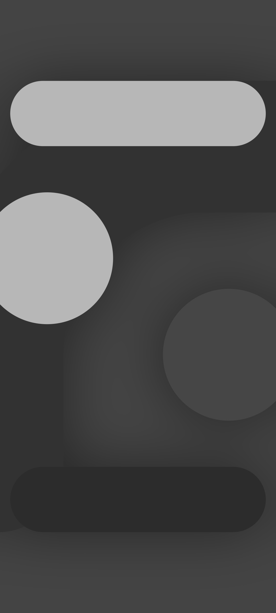
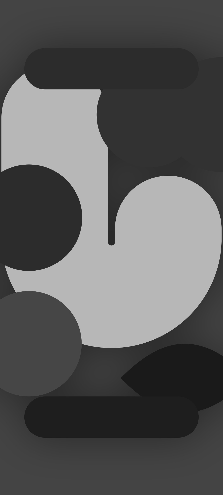
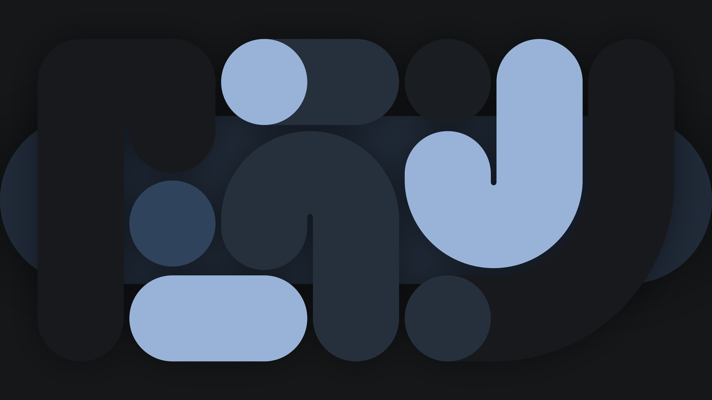

# wallgen

Генератор авторских обоев в стиле Material You (M3).

Просто запусти без флагов — и получишь случайные обои.

## Установка

**Через pip** (требуется Python ≥ 3.10, pycairo, Pillow, numpy, lxml):

```bash
git clone https://github.com/Minish777/wallgen-remastered.git
cd wallgen-remastered
pip install -e . --break-system-packages   # системная установка
# или в виртуальном окружении:
python3 -m venv .venv && . .venv/bin/activate && pip install -e .
```

**Автоматический установщик** (создаёт venv):

```bash
./install.sh
```

**Без установки** (через встроенный лаунчер):

```bash
./bin/wallgen
```

После установки доступна команда `wallgen` из любого места.

## Примеры

| Раскладка | Описание |
|-----------|----------|
| `tall` | Портретная (1080×2400), одна большая буква + акценты |
| `moon`  | Портретная, полумесяц + кольцо + лист |
| `duo`   | Портретная, две переплетённые буквы |
| `layout2` | Горизонтальная (3840×2160), зеркальная композиция |

<p align="center">
   &nbsp;
   &nbsp;
  
</p>
<p align="center">
  
</p>

## Быстрый старт

```bash
# просто занято
wallgen

# телефон
wallgen -fp 1080x2400

# тёплая тема
wallgen -t terracotta -s 1080x2400

# цвета из фотографии
wallgen -i photo.jpg -fp 1080x2400

# пачка случайных
wallgen -f -c 8 -d ~/Pix/wallgen

# авто-композиция (фигуры ранжируются по объёму)
wallgen -L auto -fp 1080x2400
```

## Флаги

- `wallgen --help` — основные флаги
- `wallgen --advanced` — полная справка
- `wallgen --version` — версия
- `wallgen --list-themes`, `--list-styles`, `--list-layouts`, `--list-shapes`

## Новое

- **Фигуры** — буквы (`boomerang`, `n`, `r`, `j`), арка, лист, кольцо, полумесяц, пилюли и круги.
- **Ранжирование по объёму** — `ranked_shapes()` сортирует все фигуры по занимаемой площади; компоновщик `compose()` собирает иерархичную композицию (доминанта → средняя → акценты), чтобы она всегда выглядела сбалансированно.
- **Авто-раскладка** `-L auto` — собирает композицию из ranked-шейпов.
- **Телефон** `-fp WxH` — вертикальная раскладка с `rotate=0` (буквы прямо).

## Разработка

```bash
make install   # установить
make lint      # проверить синтаксис
make version   # версия
make clean     # убрать .venv и кэш
```

## Лицензия

GPL-3.0 — см. [LICENSE](LICENSE)
